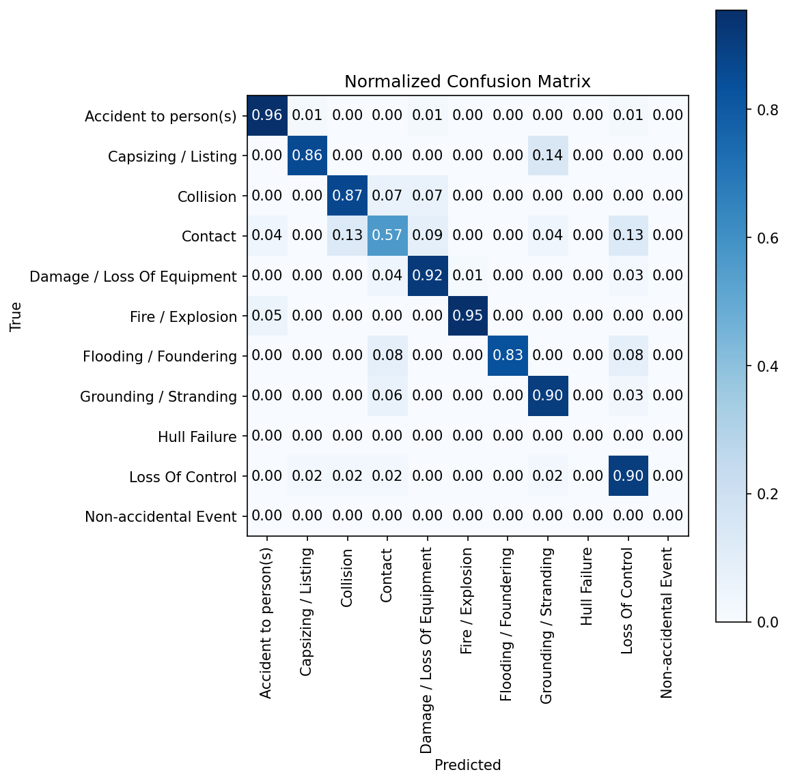
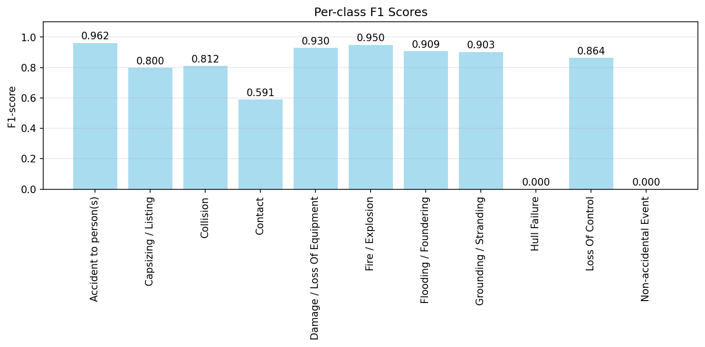

# MAIB Incident Type Classifier

A professional AI system for classifying marine incident types based on accident investigation reports from the Marine Accident Investigation Branch (MAIB).

## Overview

This system uses state-of-the-art transformer models (DeBERTa-v3) to automatically classify marine incidents into 11 different categories:

- Accident to person(s)
- Capsizing / Listing
- Collision
- Contact
- Damage / Loss Of Equipment
- Fire / Explosion
- Flooding / Foundering
- Grounding / Stranding
- Hull Failure
- Loss Of Control
- Non-accidental Event

## Features

- **Professional Architecture**: Modular, well-structured codebase following software engineering best practices
- **High Performance**: Achieves 89% accuracy and 89% weighted F1-score
- **Comprehensive Evaluation**: Includes confusion matrix, per-class metrics, and detailed reporting
- **Easy to Use**: Simple command-line interfaces for training, inference, and evaluation
- **Configurable**: YAML-based configuration system for easy customization
- **Production Ready**: Docker support, logging, error handling, and type hints

## Installation

### Prerequisites

- Python 3.8 or higher
- CUDA-compatible GPU (recommended for training)
- 8GB+ RAM (16GB+ recommended)

### Quick Start

1. **Clone and setup**:

   ```bash
   git clone <repository-url>
   cd MAIB-Incident-Type-Classifier/new
   pip install -e .
   ```

2. **Install development dependencies** (optional):

   ```bash
   pip install -e ".[dev,jupyter]"
   ```

3. **Ready to use**:
   - The system automatically downloads data from Hugging Face
   - No local data preparation required

### Google Colab Usage

```python
# In Google Colab
!git clone https://github.com/iliamunaev/MAIB-Incident-Type-Classifier.git
!cd MAIB-Incident-Type-Classifier && pip install -e .

# Train with free GPU (data automatically downloaded from Hugging Face)
!python scripts/train.py --epochs 3 --batch_size 32

# Run inference
!python scripts/inference.py --model_path outputs/best_model --interactive

# Download trained model
from google.colab import files
files.download('outputs/best_model')
```

## Usage

### Training

Train a new model:

```bash
python scripts/train.py
```

With custom parameters:

```bash
python scripts/train.py \
  --output_dir my_outputs \
  --epochs 5 \
  --batch_size 16 \
  --learning_rate 1e-5
```

### Inference

Interactive prediction:

```bash
python scripts/inference.py --model_path outputs/best_model --interactive
```

Predict from file:

```bash
python scripts/inference.py \
  --model_path outputs/best_model \
  --file input_texts.txt \
  --output predictions.json
```

Single text prediction:

```bash
python scripts/inference.py \
  --model_path outputs/best_model \
  --text "A crew member fell overboard from a motorboat"
```

### Evaluation

Comprehensive model evaluation:

```bash
python scripts/evaluate.py \
  --model_path outputs/best_model \
  --output_dir evaluation_results
```

## Evaluation Results

The model evaluation generates comprehensive visualizations and metrics:

### Visualizations

- **Confusion Matrix**: `evaluation_results/confusion_matrix.png` - Shows classification accuracy across all incident types
- **Per-Class F1 Scores**: `evaluation_results/per_class_f1.png` - Displays F1 performance for each incident category





### Detailed Metrics

The evaluation produces a detailed classification report (`evaluation_results/classification_report.txt`) with precision, recall, and F1-score for each incident type:

| Incident Type | Precision | Recall | F1-Score | Support |
|---------------|-----------|--------|----------|---------|
| Accident to person(s) | 0.97 | 0.96 | 0.96 | 67 |
| Capsizing / Listing | 0.75 | 0.86 | 0.80 | 7 |
| Collision | 0.76 | 0.87 | 0.81 | 15 |
| Contact | 0.62 | 0.57 | 0.59 | 23 |
| Damage / Loss Of Equipment | 0.94 | 0.92 | 0.93 | 72 |
| Fire / Explosion | 0.95 | 0.95 | 0.95 | 20 |
| Flooding / Foundering | 1.00 | 0.83 | 0.91 | 12 |
| Grounding / Stranding | 0.90 | 0.90 | 0.90 | 31 |
| Hull Failure | 0.00 | 0.00 | 0.00 | 0 |
| Loss Of Control | 0.83 | 0.90 | 0.86 | 42 |
| Non-accidental Event | 0.00 | 0.00 | 0.00 | 0 |

**Overall Performance:**

- **Accuracy**: 89.0%
- **Macro F1**: 70.2%
- **Weighted F1**: 89.0%

### Dataset Information

The evaluation uses the MAIB incident reports dataset with the following split:

- **Training**: 5,191 samples
- **Validation**: 288 samples
- **Test**: 289 samples

## Configuration

The system uses YAML configuration files. See `configs/config.yaml` for all available options:

```yaml
# Model Configuration
model:
  name: "microsoft/deberta-v3-base"
  max_length: 256
  num_labels: 11

# Training Configuration
training:
  learning_rate: 2e-5
  per_device_train_batch_size: 32
  num_train_epochs: 3
  output_dir: "outputs"
```

## Project Structure

```text
new/
├── src/maib_classifier/          # Main package
│   ├── data/                     # Data processing
│   ├── models/                   # Model training and evaluation
│   ├── inference/                # Inference and prediction
│   └── utils/                    # Utilities and configuration
├── scripts/                      # Command-line scripts
├── configs/                      # Configuration files
├── tests/                        # Unit tests
├── outputs/                      # Training outputs
├── logs/                         # Log files
└── data/                         # Data directory (optional for local data)
```

## API Usage

### Programmatic Usage

```python
from maib_classifier.utils.config import Config
from maib_classifier.data.processor import DataProcessor
from maib_classifier.models.trainer import ModelTrainer
from maib_classifier.inference.predictor import MAIBPredictor

# Load configuration
config = Config.from_yaml("configs/config.yaml")

# Process data
processor = DataProcessor(config)
dataset, metadata = processor.process_data()

# Train model
trainer = ModelTrainer(config)
results = trainer.train_and_evaluate(dataset, metadata)

# Make predictions
predictor = MAIBPredictor(config, "outputs/best_model")
predictor.load_model("outputs/best_model")
predictions = predictor.predict_single("Incident description text")
```

## Docker Support

Build and run with Docker:

```bash
# Build image
docker build -t maib-classifier .

# Run training
docker run -v $(pwd)/outputs:/app/outputs \
  maib-classifier python scripts/train.py

# Run with Docker Compose
docker-compose up maib-classifier
```

## Development

### Setup Development Environment

```bash
make setup-dev
```

### Run Tests

```bash
make test
```

### Code Formatting

```bash
make format
make lint
```

### Available Make Commands

- `make install` - Install package
- `make install-dev` - Install with dev dependencies
- `make train` - Train model
- `make inference` - Run inference
- `make evaluate` - Evaluate model
- `make test` - Run tests
- `make clean` - Clean build artifacts

## Performance

The system achieves the following performance metrics on the MAIB dataset:

- **Accuracy**: 89.0%
- **Macro F1**: 70.2%
- **Weighted F1**: 89.0%

### Training Time

- **GPU (Tesla T4)**: ~16 minutes for 3 epochs
- **CPU**: ~2-3 hours for 3 epochs

## Contributing

1. Fork the repository
2. Create a feature branch
3. Make your changes
4. Add tests
5. Run `make test` and `make lint`
6. Submit a pull request

## License

This project is licensed under the MIT License - see the LICENSE file for details.

## Citation

If you use this system in your research, please cite:

```bibtex
@software{maib_classifier,
  title={MAIB Incident Type Classifier},
  author={MAIB Team},
  year={2024},
  url={https://github.com/maib-team/incident-classifier}
}
```

## Support

For questions, issues, or contributions, please:

1. Check the documentation
2. Search existing issues
3. Create a new issue with detailed information
4. Contact the development team

## Acknowledgments

- Marine Accident Investigation Branch (MAIB) for providing the dataset
- Microsoft for the DeBERTa-v3 model
- Hugging Face for the transformers library
- The open-source community for various tools and libraries
- Baker Street for providing the MAIB incident reports dataset on Hugging Face
